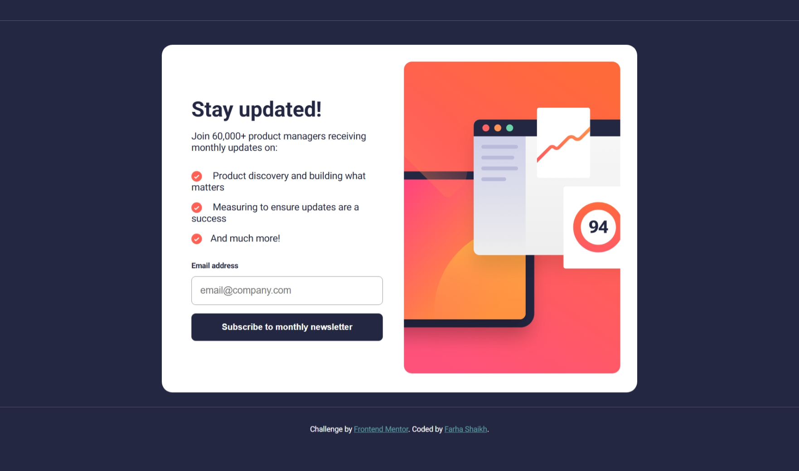

# Frontend Mentor - Newsletter sign-up form with success message solution

This is a solution to the [Newsletter sign-up form with success message challenge on Frontend Mentor](https://www.frontendmentor.io/challenges/newsletter-signup-form-with-success-message-3FC1AZbNrv). Frontend Mentor challenges help you improve your coding skills by building realistic projects.

## Table of contents

- [Overview](#overview)
  - [The challenge](#the-challenge)
  - [Screenshot](#screenshot)
  - [Links](#links)
- [My process](#my-process)
  - [Built with](#built-with)
  - [What I learned](#what-i-learned)
- [Author](#author)

## Overview

### The challenge

Users should be able to:

- Add their email and submit the form
- See a success message with their email after successfully submitting the form
- See form validation messages if:
  - The field is left empty
  - The email address is not formatted correctly
- View the optimal layout for the interface depending on their device's screen size
- See hover and focus states for all interactive elements on the page

### Screenshot



### Links

- Solution URL: [https://github.com/GraceRosario/newsletter-sign-up-with-success-message](https://github.com/GraceRosario/newsletter-sign-up-with-success-message)
- Live Site URL: [https://gracerosario.github.io/newsletter-sign-up-with-success-message/](https://gracerosario.github.io/newsletter-sign-up-with-success-message/)

## My process

### Built with

- Semantic HTML5 markup
- CSS custom properties
- Flexbox
- Mobile-first workflow

### What I learned

I learned to add and remove class, a class named hidden is necessary, and to avoid that class from overriding it should be the end of the code, be it deault code or media query one.

```css
.hidden {
  display: none;
}
```

## Author

- Frontend Mentor - [@GraceRosario](https://www.frontendmentor.io/profile/GraceRosario)
